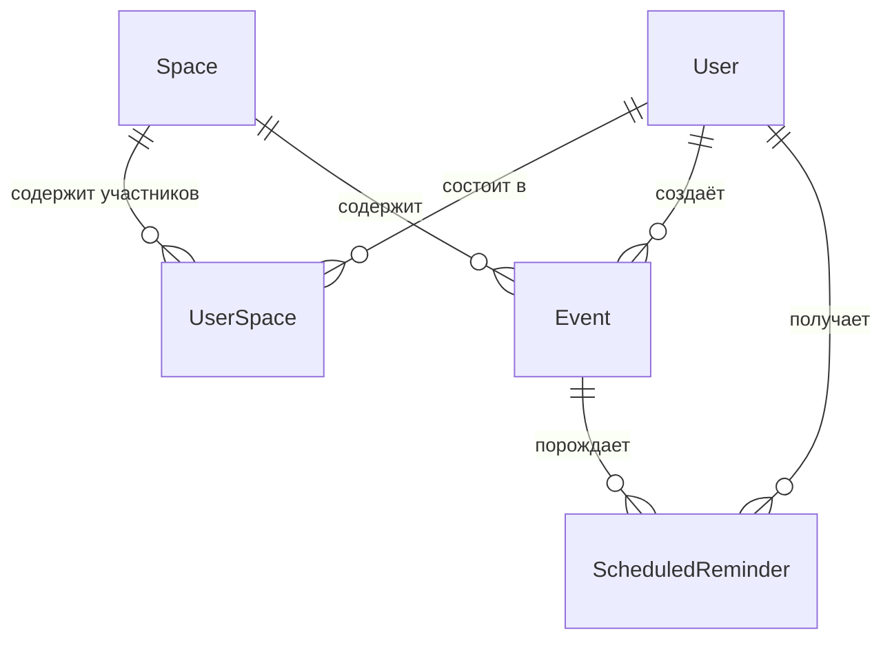

# Shared Plan Bot — Модель данных

## Обзор

Модель данных представляет **систему общего календаря и уведомлений** для Telegram. Она описывает: как организованы пользователи и пространства, как создаются и хранятся события, как планируются и отслеживаются напоминания.

Все сущности используют автоматически генерируемые первичные ключи. Временные метки используют `TIMESTAMPTZ` (с учётом часового пояса), хранятся в UTC, отображаются в `Europe/Moscow`. Мягкое удаление (soft-delete) не используется — сущности удаляются жёстко с каскадными правилами там, где это необходимо.

---

## Диаграмма связей сущностей



---

## Сущности

### User (пользователь)

Пользователь Telegram, взаимодействовавший с ботом. Создаётся при первой команде `/start` или при присоединении к пространству.

| Поле | Тип | Ограничения | Описание |
|---|---|---|---|
| `id` | `BIGINT` | PK | Telegram user ID (из Telegram API, не автогенерируемый) |
| `username` | `VARCHAR(255)` | NULLABLE | Telegram `@username` (может отсутствовать) |
| `first_name` | `VARCHAR(255)` | NOT NULL | Отображаемое имя из Telegram |
| `reminder_settings` | `JSONB` | NOT NULL, DEFAULT | Персональные настройки напоминаний |
| `created_at` | `TIMESTAMPTZ` | NOT NULL, DEFAULT NOW | Дата регистрации |

**Проектные решения**:

- Первичный ключ — Telegram user ID — естественный ключ, который избавляет от синтетического UUID и упрощает все взаимодействия с Telegram API (отправка сообщений требует Telegram ID в любом случае).
- `username` nullable, потому что Telegram не требует от пользователей устанавливать username.
- `first_name` обновляется при каждом взаимодействии для отражения актуального отображаемого имени в Telegram.
- `reminder_settings` хранит предпочтения как JSON-объект, а не в отдельной таблице. Структура фиксирована и мала (6 булевых флагов), что делает отдельную таблицу избыточной. Значение по умолчанию:

```json
{
  "1d": true,
  "2h": true,
  "1h": false,
  "30m": false,
  "15m": true,
  "0m": false
}
```

---

### Space (пространство)

Общий календарь, объединяющий участников.

| Поле | Тип | Ограничения | Описание |
|---|---|---|---|
| `id` | `UUID` | PK, DEFAULT gen_random_uuid() | Уникальный идентификатор |
| `name` | `VARCHAR(255)` | NOT NULL | Отображаемое название (например, «Семья», «Работа») |
| `invite_code` | `VARCHAR(32)` | UNIQUE, NOT NULL | Код для invite deep link |
| `created_by` | `BIGINT` | FK → users.id, NOT NULL | Администратор — создатель пространства |
| `created_at` | `TIMESTAMPTZ` | NOT NULL, DEFAULT NOW | Дата создания |

**Проектные решения**:

- `invite_code` генерируется через `secrets.token_urlsafe(6)`, создавая 8-символьную URL-safe строку. Уникальность обеспечивается на уровне базы данных. Вероятность коллизии пренебрежимо мала для ожидаемого количества пространств.
- `created_by` ссылается на администратора. Это источник истины для роли админа — администратор также записан в `user_spaces` с `role = 'admin'`, но само пространство знает своего создателя.
- Колонка `updated_at` отсутствует. Пространства создаются и потенциально удаляются, но не редактируются (название задаётся один раз). Если редактирование названия будет добавлено позже, колонку можно добавить через миграцию.

---

### UserSpace (участие в пространстве)

Связующая таблица, связывающая пользователей с пространствами и определяющая роль.

| Поле | Тип | Ограничения | Описание |
|---|---|---|---|
| `user_id` | `BIGINT` | PK (составной), FK → users.id ON DELETE CASCADE | Участник |
| `space_id` | `UUID` | PK (составной), FK → spaces.id ON DELETE CASCADE | Пространство |
| `role` | `VARCHAR(20)` | NOT NULL, CHECK IN ('admin', 'member') | Роль участника |
| `joined_at` | `TIMESTAMPTZ` | NOT NULL, DEFAULT NOW | Дата присоединения |

**Проектные решения**:

- Составной первичный ключ на `(user_id, space_id)` гарантирует, что пользователь может появиться в пространстве только один раз.
- `ON DELETE CASCADE` на обоих внешних ключах: удаление пользователя удаляет все его членства; удаление пространства удаляет все членства.
- `role` — простая строка с CHECK-ограничением, а не отдельная таблица ролей. Существует ровно две роли без перспектив расширения.

---

### Event (событие)

Запланированная запись в пространстве.

| Поле | Тип | Ограничения | Описание |
|---|---|---|---|
| `id` | `UUID` | PK, DEFAULT gen_random_uuid() | Уникальный идентификатор |
| `space_id` | `UUID` | FK → spaces.id ON DELETE CASCADE, NOT NULL | Пространство-владелец |
| `title` | `VARCHAR(500)` | NOT NULL | Название события (извлечено LLM) |
| `event_date` | `DATE` | NOT NULL | Дата события |
| `event_time` | `TIME` | NULLABLE | Время события (null = событие на весь день) |
| `created_by` | `BIGINT` | FK → users.id, NOT NULL | Пользователь, создавший событие |
| `raw_input` | `TEXT` | NULLABLE | Исходное сообщение пользователя (для отладки/аудита) |
| `created_at` | `TIMESTAMPTZ` | NOT NULL, DEFAULT NOW | Дата создания записи |

**Проектные решения**:

- `event_date` и `event_time` — отдельные колонки, а не единый `TIMESTAMPTZ`. Это сделано намеренно: многие события не имеют компонента времени («День рождения Ани 5 апреля»). Nullable `TIME` чисто представляет это, тогда как `TIMESTAMPTZ` с сигнальным значением (полночь) было бы двусмысленным.
- `raw_input` сохраняет исходное сообщение пользователя (или транскрипцию голоса). Полезно для отладки проблем с парсингом LLM — можно увидеть, что пользователь сказал, в сравнении с тем, что бот интерпретировал.
- `ON DELETE CASCADE` от пространства: удаление пространства удаляет все его события и (транзитивно) все связанные напоминания.

**Индекс**: `idx_events_space_date` на `(space_id, event_date)` — поддерживает запрос `/events` (ближайшие события пространства, отсортированные по дате).

---

### ScheduledReminder (запланированное напоминание)

Предвычисленная запись напоминания для конкретного пользователя и события.

| Поле | Тип | Ограничения | Описание |
|---|---|---|---|
| `id` | `UUID` | PK, DEFAULT gen_random_uuid() | Уникальный идентификатор |
| `event_id` | `UUID` | FK → events.id ON DELETE CASCADE, NOT NULL | Связанное событие |
| `user_id` | `BIGINT` | FK → users.id ON DELETE CASCADE, NOT NULL | Получатель |
| `remind_at` | `TIMESTAMPTZ` | NOT NULL | Точная метка времени для отправки напоминания |
| `reminder_type` | `VARCHAR(10)` | NOT NULL | Ключ интервала: `1d`, `2h`, `1h`, `30m`, `15m`, `0m` |
| `sent` | `BOOLEAN` | NOT NULL, DEFAULT FALSE | Было ли напоминание доставлено |

**Проектные решения**:

- Напоминания **предвычисляются при создании события**. Альтернатива — расчёт наступивших напоминаний на каждом тике планировщика на основе настроек пользователя — была бы сложнее, труднее отлаживалась и не работала бы быстрее на данном масштабе.
- `remind_at` — конкретная временная метка, а не относительное смещение. Это делает запрос планировщика тривиальным: `WHERE sent = FALSE AND remind_at <= NOW()`.
- `sent` — простой булев флаг, а не enum статусов. Существуют только два состояния: не отправлено и отправлено. Неудачные отправки всё равно помечаются как отправленные (см. документ «Архитектура» — Алгоритм обработки напоминаний).
- `ON DELETE CASCADE` от события и пользователя: удаление события удаляет все его напоминания; удаление пользователя удаляет все его напоминания.
- `reminder_type` хранится для целей отображения — сообщение напоминания содержит «Через 15 минут» или «Завтра», и тип определяет это форматирование.

**Индекс**: `idx_reminders_remind_at_sent` на `(remind_at, sent)` — это **критически важный индекс производительности**. Запрос планировщика выполняется каждые 30 секунд и должен эффективно находить неотправленные напоминания, чьё время наступило. Частичный индекс `WHERE sent = FALSE` был бы ещё эффективнее, но добавляет сложности; простого составного индекса достаточно на данном масштабе.

---

## Карта каскадного удаления

Что происходит при удалении сущностей:

| Удаляемая сущность | Каскадные удаления |
|---|---|
| **User** | Все записи `user_spaces` (членства), все `scheduled_reminders` этого пользователя |
| **Space** | Все записи `user_spaces` (членства), все `events` пространства, все `scheduled_reminders` этих событий |
| **Event** | Все `scheduled_reminders` этого события |

События **не** удаляются каскадно при удалении пользователя — событие остаётся в пространстве, даже если его создатель уходит. Внешний ключ `created_by` на событиях не имеет каскадного удаления. Если создатель удалён, событие сохраняется со ссылкой на отсутствующего пользователя (слой отображения обрабатывает это, показывая «Удалённый пользователь»).

---

## JSONB-схема: reminder_settings

Поле `users.reminder_settings` использует фиксированную схему:

```json
{
  "1d":  boolean,
  "2h":  boolean,
  "1h":  boolean,
  "30m": boolean,
  "15m": boolean,
  "0m":  boolean
}
```

**Валидация**: Слой приложения (Pydantic-модель) валидирует эту структуру при чтении и записи. База данных трактует её как непрозрачный JSONB — никакой валидации схемы на уровне БД.

**Путь миграции**: Если в будущем будут добавлены новые интервалы напоминаний, у существующих пользователей в настройках не будет новых ключей. Слой приложения должен использовать `.get(key, default_value)` при чтении настроек, чтобы отсутствующие ключи по умолчанию были `False` (выключены).

---

## Ключевые проектные решения

1. **Telegram ID как первичный ключ User** — Таблица `users` использует Telegram user ID как первичный ключ вместо генерации синтетического UUID. Каждое взаимодействие с Telegram API требует этот ID, поэтому это естественный ключ. Это избавляет от паттерна поиска-по-внешнему-ID при каждом сообщении.

2. **Раздельные колонки даты и времени** — События хранят `DATE` и `TIME` как отдельные колонки. Это чисто обрабатывает события без компонента времени (дни рождения, события на весь день) через nullable `TIME`, а не кодирование «нет времени» как магическое значение timestamp.

3. **Предвычисленные напоминания** — Напоминания материализуются как строки в момент создания события, а не вычисляются на лету. Это делает работу планировщика простой (запрос + отправка), упрощает отладку (достаточно посмотреть таблицу `scheduled_reminders`) и естественно обрабатывает правило «не создавать прошедшие напоминания» в момент создания.

4. **JSONB для настроек напоминаний** — JSON-колонка в таблице пользователей вместо таблицы `user_reminder_preferences` со строками для каждого интервала. Настройки малы (6 булевых значений), всегда читаются и записываются как единое целое и не имеют реляционного смысла. JSONB проще.

5. **Без soft-delete** — В отличие от систем, которым нужно сохранять исторические данные для аудита, личному календарному боту это не требуется. Жёсткое удаление с каскадами поддерживает базу данных чистой, а запросы — простыми.

6. **Без отдельной сущности «уведомление»** — Система отправляет уведомления (оповещения о новых событиях, новых участниках) как fire-and-forget Telegram-сообщения. Таблицы уведомлений или отслеживания доставки для них нет. Только напоминания — которые имеют запланированную будущую доставку — персистируются. Это разграничение поддерживает модель данных сфокусированной: если уведомление не отправилось — залогировано и забыто; если напоминание не отправилось — оно всё равно помечается как отправленное (нет очереди повторов для Telegram-сообщений пользователям, которые могли заблокировать бота).
